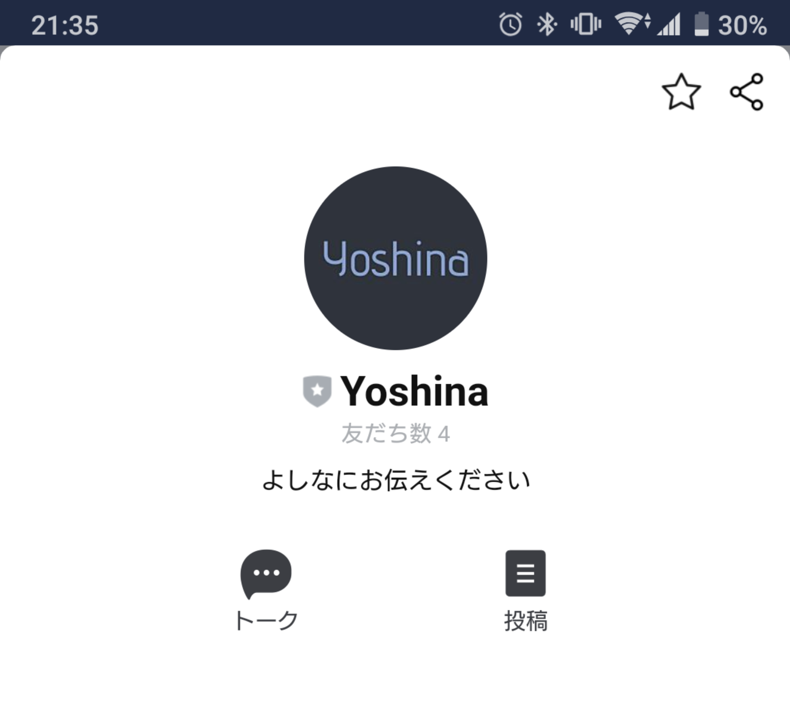
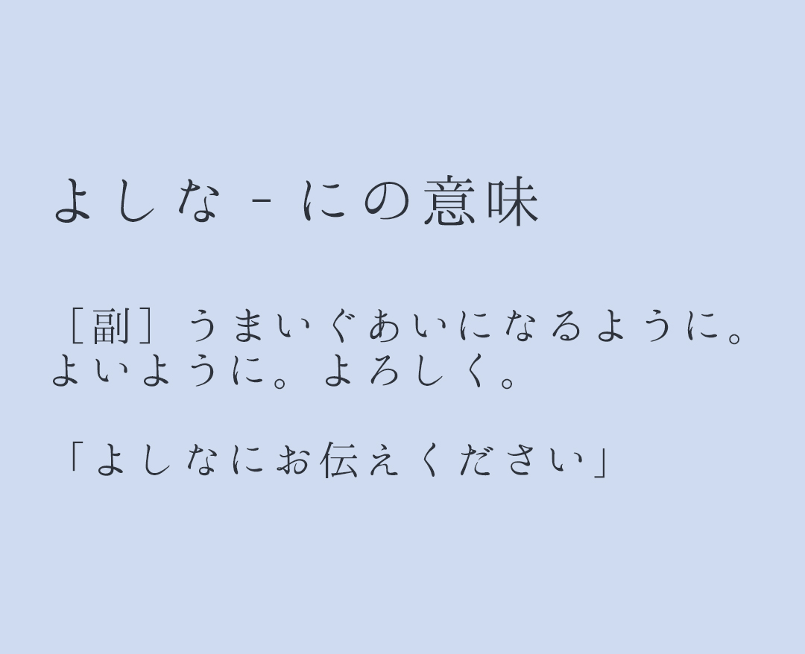
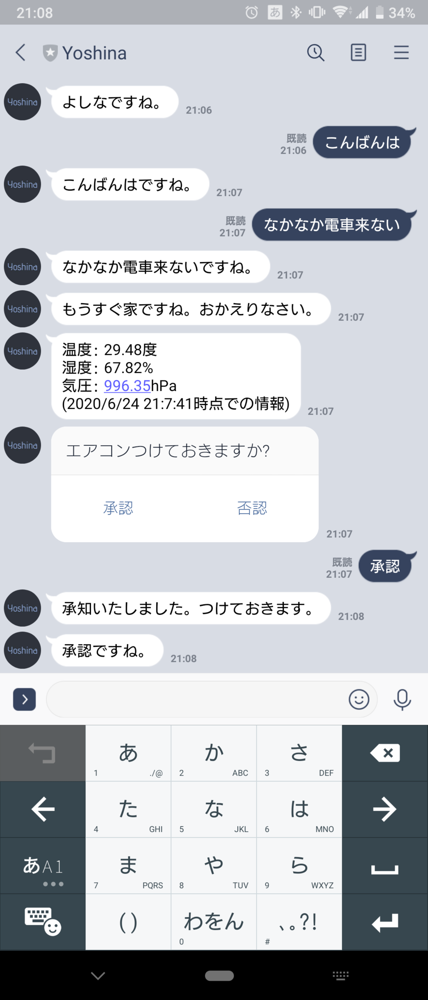
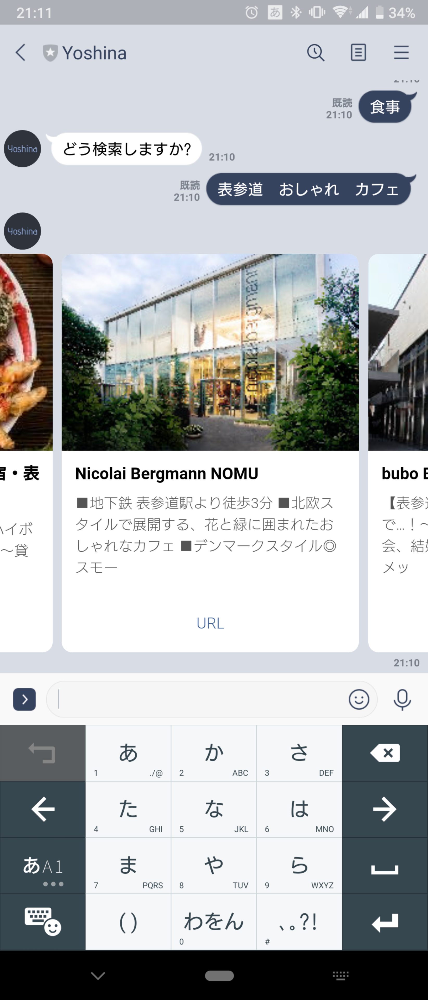

# README

ちょっと面倒なことをよしなにやってくれるLINEbot AI "Yoshina"

## どんなことができる?

家に近づいてきたら、帰宅を察知してエアコンをつけるかどうか確認してくれる。自分は「承認」するだけ。

食事の場所決めに困った時、検索すれば適当に候補を挙げてくれる。

|家に近づいたらエアコン起動するかチェック|インタラクティブに飲食店を検索|
|:-:|:-:|
|| |

## 技術的な概要説明

### LINE Bot全般

PythonおよびPython用のLINE bot SDKを使ってWebアプリとして作成。

Herokuにデプロイしてあり、ユーザーからのメッセージが届いた時にだけ起動するようになっている。

ユーザーとの対話を実現するためには状態管理をする必要があり、ユーザーごとに現在提供中のサービスをデータベースで管理してある。データベースはHeroku Postgresを使用。

#### キーワード

- Python
- LINE Messaging API SDK for Python ([URL - Github](https://github.com/line/line-bot-sdk-python))
- Heroku, Heroku Postgres ([URL - Heroku](https://jp.heroku.com/))

### エアコン制御に関して

ユーザーがエアコンをつけるか判断するために、ネットに繋がるマイコン(ESPr Developer/ESP8266)と環境センサ(BME280)を使って室内環境をモニタリング。センサの値はThingSpeakに一定間隔でアップロードされ保存されている。

帰宅の検知にはGPS情報を使用しており、GPS情報に応じてLINEbot側からユーザーへ確認メッセージを送信するのはIFTTTのGPS-WebHook連携で実現している。  
IFTTTには、GPS情報をトリガーに特定URLへWebリクエストを送るよう設定してあり、LINEbot側には特定URLへのリクエストがあったときの挙動を記述してある。

#### キーワード

- ThingSpeak ([URL - ThingSpeak](https://thingspeak.com/))
- ESPr Developer(ESP8266) ([URL - SWITCH SCIENCE](https://www.switch-science.com/catalog/2500/))
- BME280 ([URL - SWITCH SCIENCE](https://www.switch-science.com/catalog/2236/))
- IFTTT ([URL - IFTTT](https://ifttt.com/))

### インタラクティブ飲食店検索に関して

「食事」をキーワードとしてLINEbotがレストラン検索モードに移行する。
「ぐるなびレストラン検索API」で、検索ワードをクエリとしてフリーワード検索して、APIから取得した結果をカルーセル型のメッセージに加工してユーザーに返信している。

ユーザーからのメッセージが送られてきた時に、レストラン検索モードとして返答するかどうかの判定を行う必要があるため、ユーザーのステータスをデータベースで管理してある(状態管理)。

#### キーワード

- ぐるなびレストラン検索API ([URL - ぐるなびレストラン検索API](https://api.gnavi.co.jp/api/manual/restsearch/))
